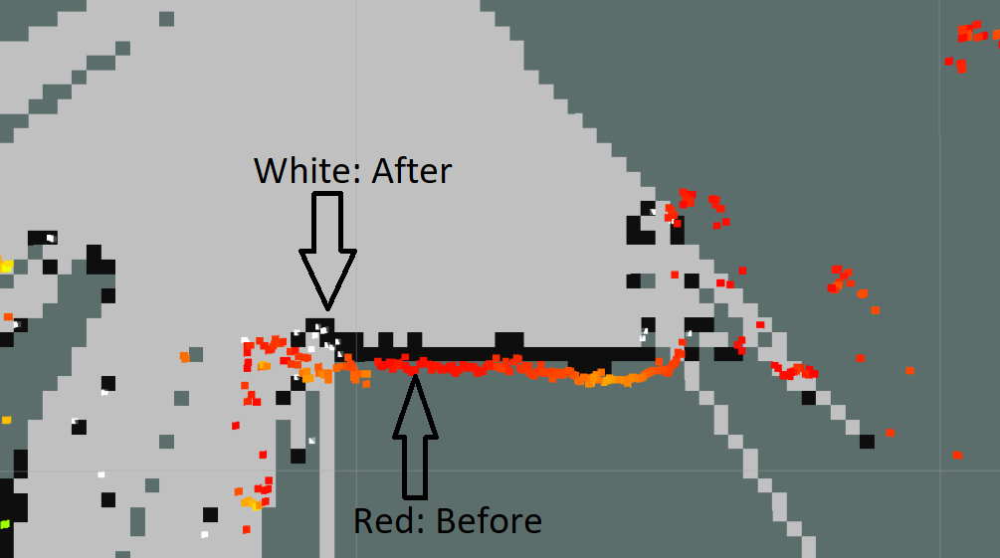

# Laser Static Map Mask/Subtraction Filter (ROS2 Humble)

# todo: occupancy_grid code has no clear license

Subtract a static map (`OccupancyGridMap`) from a point cloud (`PointCloud2`). This can be used for example to remove obstacles from a point cloud or 2D lidar scan. The map serves as a masking layer for the point cloud.

<!-- This package is intended to be used for example in conjunction with [obstacle_detector](https://github.com/jk-ethz/obstacle_detector).

If you only got a `sensor_msgs::LaserScan`, you can use the `scans_merger` node in the `obstacle_detector` package to get a `sensor_msgs::PointCloud2` msg, which is required as an input to this package. -->



## Installation

```bash
cd ament_ws/src
git clone https://github.com/giuschio/static_map_filter_2.git
cd ..
colcon build
```

## Usage
```bash
ros2 launch laser_static_map_filter laser_static_map_filter.launch.py
```
